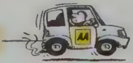

## Section 2 Attitude

The government road safety organisations believe that the ATTITUDE of learner drivers is extremely important for road safety.

## Attitude means

- Your frame of mind when you get in the car
- How you react when you meet hazards on the road
- How you behave towards other drivers

Attitude is a very important part of being a good driver. Your attitude when you are driving plays a big part in ensuring your safety and that of other road users.

Do you aim to be a careful and safe driver or a fast and skilful driver? If you don't want to end up as another road accident statistic, then carefully and safely is the way to go.

Remember that a car is not an offensive weapon, and often people don't realise what a potentially lethal machine they are in control of when they get behind the wheel. You only have to think about this to understand the importance of your attitude when driving.

You'll see that questions in this section are concerned with encouraging you to be a careful and safe driver, and cover:

- Tailgating
- Consideration for other road users, including pedestrians, buses, slow-moving vehicles and horse riders
- Driving at the right speed for the conditions
- When to flash headlights
- The right place, time and way to overtake

And remembering a few dos and don'ts will help you achieve the right attitude for driving and make passing this section of the test much easier.

## Good drivers do

- drive at the right speed and for the road and traffic conditions
- observe speed limits
- overtake only when it is safe to do so
- park in correct and safe places
- wait patiently if the driver in front is a learner or elderly or hesitant
- look out for vulnerable road users such as cyclists, pedestrians and children
- concentrate on their driving at all times
- plan their journey so that they have plenty of time to get to their destination

## Good drivers don't · allow themselves to bec

- Good drivers don't · allow themselves to become involved in road rage allow them

road rage
- break speed limits
- drive too fast, particularly in wet, foggy or icy weather
- accelerate or brake too harshly
- overtake and 'cut in', forcing others to brake sharply overtake and

- put pressure on other drivers by driving too close behind them (this is called 'tailgating'), flashing headlights or gesturing
- allow their attention to be distracted by passengers, mobile phones or loud music, or what is happening on the road, such as staring at an accident

## Attitude

## Tailgating

Driving excessively close behind another vehicle is known as tailgating - and it's dangerous! The car in front may stop suddenly (to avoid hitting a child or animal that has dashed out into the road, for example); when this happens the car following runs the risk of crashing into it.

You should always leave enough space between your vehicle and the one in front, so that you can stop safely if the driver in front suddenly slows down or stops.

Rear-end shunts account for a large percentage of all accidents on the road. In these situations, the driver of the car behind is almost always judged to be the guilty party.

So tailgating is potentially expensive as well as dangerous.

Another time when drivers are tempted to tailgate is when attempting to pass a large, slow-moving vehicle. However, keeping well back will improve your view of the road ahead, so that you're better able to judge when it's safe to overtake and the driver of the large vehicle will also be able to see you.

## Useful tip

If you are being followed too closely by another driver you should slow down and increase the distance between your vehicle and the one in front. If you slow down or have to stop suddenly, the driver behind may crash into you, but you will have increased your stopping distance and will not be pushed into the vehicle in front of you.

## Always remember

- Expect the unexpected, and make provision for the potential errors of other drivers everyone makes mistakes sometimes.
- Don't create unnecessary stress for other drivers by showing your frustration in an aggressive manner.

\

If you are driving at the right speed for the road and weather conditions and a driver behind tries to overtake, you should pull back a bit from the vehicle in front so that if the driver behind insists on overtaking, there is less risk of an accident.

Do not try to stop the car behind from overtaking. Do not move into the middle of the road or move up close to the car in front. These actions could be very dangerous.

You should not give confusing signals such as indicating left or waving the other driver on. V \_ other driv

V \_ J

Now test yourself on the questions about Attitude

