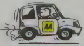

## Section 3 Safety and Your Vehicle

When you go through this section you will notice that the questions are a bit of a mixture. They cover a number of topics about SAFETY, including:

- Understanding the controls of your vehicle
- What the car's warning lights tell you
- Tyres - correct inflation, pressures and tread depths
- When to use hazard warning lights
- Passenger safety
- The environment
- Security and crime prevention

Many of the questions in this section are to do with 'legal requirements' and rules regarding parking your car and using lights. Look up all the sections in The Highway Code that deal with parking rules. Find out the rules for red routes, white lines and zigzag lines as well as yellow lines.

ts

;

-

## / -

Seat belt

;

belts

;

lts

;

-

driver you

V

If any of your passengers are young people under 14, you are responsible for making sure that they wear seat belts. You are responsible for them by law, even if you are still a learner driver yourself. V \_ J

## Tips for this section

Learn The Highway Code and you will be able to answer most of the questions in this section. In particular make sure you know the rules regarding seat belts, tyres, and when to

## Safety and Your Vehicle

use your lights, including your hazard warning lights.

## A confusing question

One of the most confusing questions in this section asks what kind of driving results in high fuel consumption. The answer, of course, is bad driving - especially harsh braking and acceleration. This means you will use more fuel than you should and therefore cause more damage to the environment than is necessary.

BUT many people read the word 'high' as meaning 'good' - as in a level of driving skill and so pick the wrong answer.

Don't let it be you...

Now test yourself on the questions about Safety and Your Vehicle

The Theory Test 119

