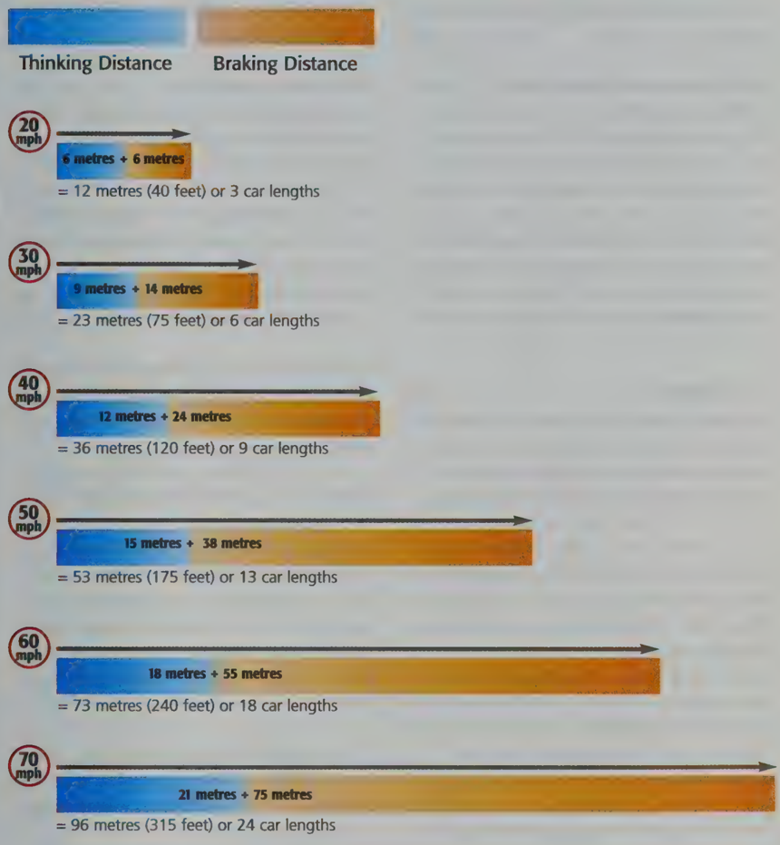

## Section 4 Safety Margins

Experienced drivers are usually better than new or learner drivers at leaving good SAFETY MARGINS. Learner drivers find it harder to keep their vehicle at a safe distance from the one in front. Therefore the questions in this section cover

- safe stopping distances and
- safe separation distances (these are the same as safety margins)

## What is a safety margin?

A safety margin is the space that you need to leave between your vehicle and the one in front so that you will not crash into it if it slows downs or stops suddenly. They are also called 'separation distances' and are an important part of anticipating road and traffic hazards. When you are learning to drive, you can feel pressured to speed up by drivers behind you.

Don't let other drivers make you cut down on your safety margins. Stay a safe distance ehind the vehicle in front. Then you will have time to anticipate and react to hazards.

## The two-second rule

In traffic that's moving at normal speed, allow at least a two-second gap between you and the vehicle in front.

## Stopping distances

Many people who are taking their Theory Test get confused about this. You will notice that some of the questions ask for your overall stopping distance and others ask for your braking distance. These are different.

Overall stopping distance or stopping distance is not the same as braking distance. Stopping distance is made up of thinking distance + braking distance.

In other words, the time it takes to notice that there's a hazard ahead plus the time it takes to brake to deal with it. there's a hazard ahead pl

to brake to deal with it.

## Thinking distance

Thinking distance is sometimes called reaction time or reaction distance. If you are driving at 30mph, your thinking distance will be 30 feet (9 metres). That means your vehicle will travel 30 feet (9 metres) before you start braking.

## The link between stopping distance and safety margins

You should always leave enough space between your vehicle and the one in front. If the other driver has to slow down suddenly or stop without warning, you need to be able to stop safely. The space is your safety margin.

## Safety margins for other vehicles

Long vehicles and motorcycles need more room to stop - in other words, you must leave a bigger safety margin when following a long vehicle or motorbike. When driving behind a long vehicle, pull back to increase your separation distance and your safety margin so that you get a better view of the road ahead - there could be hazards developing and if you are too close he will be unable to see you in his rear view mirror. Strong winds can blow

## Safety Margins

lorries and motorbikes off course. So leave a bigger safety margin.

## Different conditions and safety margins

You may find that one or more questions in your Theory Test might be about driving in 'different conditions'. These questions aim to make sure you know what adjustments you should make to your driving when either road conditions are different from normal, for example, when parts of the road are closed off for roadworksor weather conditions affect your driving.

## Road works

You should always take extra care when you see a sign warning you that there are road works ahead. Remember, road works are a hazard and you have to anticipate them.

If you see the driver in front of you slowing down, take this as a sign that you should do the same - even if you can't see a hazard ahead. You still need to keep a safe distance from him. Harassing the driver in front by 'tailgating' is both wrong and dangerous and so is overtaking to fill the gap. It's especially important that you know what to do when you see a sign for road works ahead on a motorway.

- There may be a lower speed limit than normal - keep to it.
- Use your mirrors and indicators, and get into the correct lane in plenty of time.
- Don't overtake the queue and then force your way in at the last minute (this is an example of showing an inconsiderate attitude to other road users).
- Always keep a safe distance from the vehicle in front.

## Weather conditions

In bad weather (often called 'adverse' weather), you need to increase your In bad weather (often called 'adverse' weather), you need to increase your safety margins.

When it's raining you need to leave at least twice as much distance between you and the vehicle in front. When there's ice on the road leave an even bigger gap because your stopping distance increases tenfold.

It's amazing how often drivers go too fast in bad weather. In adverse weather motorways have lower speed limits, but some drivers don't take any notice of them.

When it's icy you should multiply your two-second gap by ten.

## Questions that look alike

There are a number of questions about anti-lock brakes in this section. Lots of questions look the same. Some are easy and some are hard. Some of them appear to be the same but they are not.

The questions test two things - your knowledge of the rules of the road and your understanding of words to do with driving.

Now test yourself on the questions about Safety Margins

