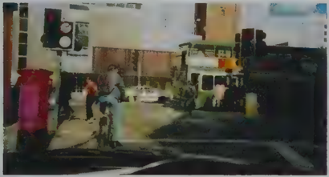
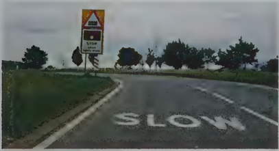
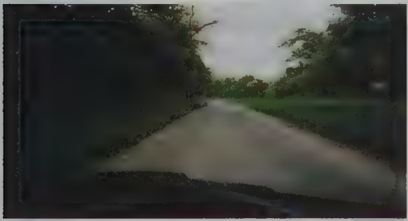
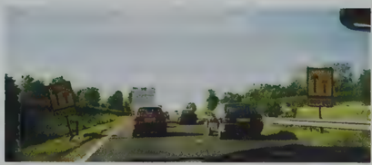
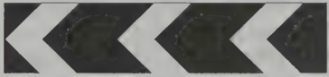
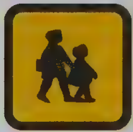

## Section 5 Hazard Awareness

How often does a motorist protest that the accident happened before they had time to realise the person they hit was there? Some accidents will inevitably happen, but part of your instructor's job while teaching you to drive is to help you learn to anticipate problems before they happen.

What is the difference between Hazard Awareness and Hazard Perception?

- Hazard Awareness and Hazard Perception mean the same thing.
- Hazard Perception is the name for the part of the Theory Test that uses video clips. This test is about spotting developing hazards. One of the key skills of good driving, this is called anticipation.
- Anticipating hazards means looking out for them in advance and taking action now.
- Hazard Awareness is about being alert whenever you are driving.

That is why some of the questions in the HAZARD AWARENESS section deal with things that might make you less alert. For example feeling tired, feeling ill, taking medicines prescribed by your doctor or drinking alcohol

Other questions in Hazard Awareness cover noticing road and traffic signs as well as road markings, what to do at traffic lights and when to slow down for hazards ahead.

## Why are young male drivers more at risk? Why are young

more at risk?

New drivers have a greater than average chance of being involved in accidents. Statistics show that young male drivers have the most accidents.

- Maybe it's because when they first get their licence they want to show off to other drivers.
- Some people think that driving much too fast will earn them 'respect' from their friends.
- Some people think that they are such good drivers that the rules of the road should not apply to them.

Whatever the reason - drivers who don't watch out for hazards are at risk of being involved in an accident. The problem has a lot to do with people's attitude to driving. You'll find more about this aspect of driving in the to do with people's attitude to driving. You'll find more about this aspect of driving in the Attitude part of the Theory Test.

We've already said that young drivers often don't learn to anticipate hazards until they are older and more experienced. The Hazard Perception test aims to 'fill the gap' in hazard perception for young drivers and other new drivers by making sure they have some proper training to make up for their lack of experience.

This should make them safer drivers when they start out on the road alone.

## Looking for clues to hazards developing on the road

As you get more driving experience you will start to learn about the times and places where you are most likely to meet hazards. Think about some of these examples.

## Rush hour

You know that people take more risks when driving in the rush hour. Maybe they have to drop their children off at school before going to work. Maybe they are late for a business meeting. So you have to be prepared for bad driving, such as other drivers pulling out in front of you.

## Dustbin day

Drivers in a hurry may get frustrated if they are held up in traffic because of a hazard such as a dustcart. They may accelerate and pull out to overtake even though they cannot see clearly ahead. You should not blindly follow the lead of another driver. Check for yourself that there are no hazards ahead.

## Schoolchildren

Young children are often not very good at judging how far away a car is from them, and may run into the road unexpectedly. Always be on the lookout for hazards near a school entrance.

## Parked cars

Imagine you are driving on a quiet one-way street with cars parked down each side of the road. You wouldn't expect to meet any vehicles coming the other way - but what about children playing? They might run out into the road after a football. It would be difficult to see them because of the parked cars, until they were in the road in front of you.

## More examples of hazards

So, what kinds of hazards are we talking about? And what should you do about them?

Road markings and road signs sometimes highlight likely hazards for you.

The list below gives some of the hazards you should look out for when driving along a busy street in town.

After each hazard there are some ideas about what you should be looking out for, and what to do next.

- You see a bus which has stopped in a lay-by ahead.

There may be some pedestrians hidden by the bus who are trying to cross the road, or the bus may signal to pull out. Be ready to slow down and stop.

- You see a white triangle painted on the road surface ahead.

This is a hazard warning sign. It tells you that there is a 'Give Way' junction just ahead. Slow down and be ready to stop.

- You see a sign for a roundabout on the road ahead.

Anticipate that other drivers may need to change lane, and be ready to leave them enough room.

- You come to some road works where the traffic is controlled by temporary traffic lights. Watch out for drivers speeding to get through before the lights change.
- You look in your rear view mirror and see an emergency vehicle with flashing lights coming up behind you.

An emergency vehicle wants to pass, so get ready to pull over when it's safe.

- You see a small child standing with an adult near the edge of the pavement.

Check if the child is safely holding the adult's hand. Be ready to stop safely if the child suddenly steps into the road.

- You notice dustbins or rubbish bags put out on the pavement.

The dustcart could be around the next corner, or the bin men could be crossing the road with bags of rubbish. Be ready to slow down and stop if necessary.

- You hear a siren.

Look all around to find out where the emergency vehicle is. You may have to pull over to let it pass.

You will find out more about the different types of hazards you may encounter, including what to look for when driving on narrow country roads, or in bad (adverse) weather conditions, in the Vehicle Handling section of this book.

## Hazard Awareness

## Always expect the unexpected

Don't forget that not all hazards can be anticipated. There are bound to be some you haven't expected.

## Red flashing warning lights

Level crossings, ambulance stations, fire stations and swing bridges all have red lights that flash on and off to warn you when you must stop.

## Observation

Another word for taking in information through our eyes is observation. Observation is one of the three key skills needed in hazard perception. The three skills are

- observation
- anticipation
- planning

An easy way to remember this is O A P for

Observe

Anticipate

Plan

## Talk to yourself!

It's a good idea to 'talk to yourself' when you're learning to drive - and even after you've passed your test. Talk about all the things you see that could be potential hazards. Your driving instructor might suggest this as a way of making you concentrate and notice hazards ahead.

## Hazard Awareness

Even if you don't talk out loud, you can do a 'running commentary' in your head on everything you see around you as you drive.

For example, you might say to yourself 'I am following a cyclist and the traffic lights ahead are red. When the lights change I will allow him/her plenty of time and room to move off. ' or

mov

or

'The dual carriageway ahead is starting to look very busy. There is a sign showing that the right lane is closing in 800 yards. I must get ready to check my mirrors and, if safe to do so, drop back to allow other vehicles to move into the left-hand lane ahead of me. '

Note: Don't forget the mirrors! This way, you will notice more hazards, and you will learn to make more sense of the information that your eyes are taking in.

## Scanning the road

Learner drivers tend to look straight ahead of their car and may not notice all the hazards that might be building up on both sides. You will spot more hazards when driving if you train yourself to scan the road.

- Practise looking up and ahead as far as possible.
- Use all your mirrors to look out for hazards too.
- Don't forget that you have 'blind spots' when driving - work out where they are and find safe ways of checking all round for hazards.
- Ask your driving instructor to help you with all of this.

Learn your road signs!

Notice the information at the bottom of the first page of traffic signs in The Highway Code. It explains that you won't find every road sign shown here.

You can buy a copy of Know Your Traffic Signs from a bookshop to see some of the extra signs that are not in The Highway Code.

Note: In Wales, some road signs include the Welsh spelling as well as the English, and in Scotland, some signs are written using Gaelic spelling. You'll also see some 'old-style' road signs around, which are slightly different too.

V \_ J

How is learning to scan the road going to help me pass my Theory Test?

- The idea of the Hazard Perception element of the test is to encourage you to get some real experience of driving before you take the Theory Test.
- If you meet real hazards on the road and learn how to anticipate them, you'll learn how to pass the Hazard Perception element of the test.
- In the video test you may not be able to look all around you as you would when driving a car; but the clips will be as realistic as possible in giving you a wide 'view' of the road ahead. as possible in giv

## Observation questions

Study some of the pictures in the Hazard Awareness section.

They include photographs of scenes such as

- a cyclist at traffic lights, seen from the viewpoint of a driver in a car behind the cyclist
- what you see as a driver when you are approaching a level crossing
- what you see when coming up to a 'blind bend'
- a view of the road ahead with traffic building up where one lane is closing.

Look out for situations like these when you are out driving with your instructor, and use the practice to improve your hazard awareness.

As well as photographs, there are pictures of road and traffic signs.

## What do these signs mean?

What actions should you take when you see these signs?

- If you are not sure, look them up in The Highway Code.
- Think about why the square yellow sign with the two children is in the Vehicle Markings section and not with the rest of the road signs.

Now test yourself on the questions about Hazard Awareness the questions abou

Hazard Awareness

## Vulnerable Road Users

