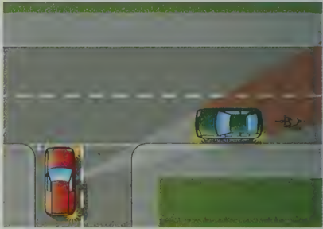
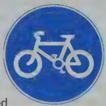

# Section 6 Vulnerable Road Users

Today's new vehicles are becoming safer all the time for the driver inside the car, but sadly this is not always the case for the pedestrian or cyclist outside. Many road users who are not driving cars have nothing to protect them if they are in an accident with a motor vehicle.

The questions in the VULNERABLE ROAD USERS section deal with the following:

- why different types of road users are vulnerable
- what you as a driver must do to keep them safe

Who are vulnerable road users? The following are all vulnerable road users and you must drive with extra care when you are near vulnerable road users.

- pedestrians
- children
- elderly people
- people with disabilities
- cyclists
- motorcycle riders
- horse riders
- learner drivers and new drivers
- animals being herded along the road

## Cyclists

Give cyclists plenty of room. Remember to keep well back from cyclists when you are coming up to a junction or a roundabout because you cannot be sure what they are going to do. On the roundabout they may go in any direction - left, right or straight ahead. They are allowed to stay in the left lane and signal right if they are going to continue round. Leave them enough room to cross in front of you if they need to. Turn to the section headed Vulnerable Road Users in the Theory Test questions to see some pictures of this. You must also give way to cyclists at toucan crossings and in cycle lanes (see the rules for cyclists set out in The Highway Code).

## Look out for cyclists

- It can be hard to see cyclists in busy town traffic.
- It can also be hard to see them coming when you are waiting to turn out at a junction. They can be hidden by other vehicles.

Always be on the lookout for cyclists. Especially, check your mirror to make sure you do not trap a cyclist on your left when you are turning left into a side road. Check your blind spots for cyclists, too.

## Controlling your vehicle near cyclists

When you are following a cyclist, you must be able to drive as slowly as they do, and keep your vehicle under control. Only overtake

when you can allow them plenty of room, and it is safe to do so.

r

C

## Cycle lanes

Cycle lanes are reserved for cyclists. Car drivers should not use them.

A cycle lane is marked by a white line on the road. A solid white line means you must not drive or park in the cycle lane during the hours it is in use.

A broken white line means that you should drive or park in it only if there is no alternative. You should not park there at any time when there are waiting restrictions.

v

wa

r

When you overtake a cyclist, a motorcyclist or a horse rider, give them at least as much room as you would give a car.

v

w

J

## Cyclists and motorcycle riders

Cyclists and motorcycle riders are more at risk than car drivers because

- they are more affected by strong winds, or by turbulence caused by other vehicles
- they are more affected by an uneven road surface, and they may have to move out suddenly to avoid a pot-hole
- car drivers often cannot see them

## Vulnerable Road Users

## Pedestrians

Pedestrians most at risk include elderly people and children. Elderly people and others who cannot move easily may be slower to cross roads - you must give them plenty of time. Children don't have a sense of danger on the road; they can't tell how close a car is, or how fast it is going. They may run out into the road without looking. Or they may step out behind you when you are reversing - you may not see them because they are small.

## People who are unable to see and/or hear

A blind person will usually carry a white stick to alert you to their presence. If the stick has a red band, this means that the person is also deaf, so will have no warning of an approaching car either visually or from engine noise.

## When to give way to pedestrians

At any pedestrian crossing, if a pedestrian has started to cross, wait until they have reached the other side. Do not harass them by revving your engine or edging forward.

At a crossing with lights (pelican, toucan or puffin crossings), pedestrians have priority once they have started to cross even if, when on a pelican crossing, the amber lights start flashing:

Once a pedestrian has stepped on to a zebra crossing, you must stop and wait for them to cross.

Note: It is courteous to stop at a zebra crossing if a pedestrian is waiting to cross.

When you take your Practical Driving Test, you must stop for any pedestrians who are waiting on the pavement at a zebra crossing even if they haven’t stepped on to the crossing yet. However, you must not wave to them to cross.

If you want to turn left into a side road and pedestrians have already started to cross the side road on foot, wait for them to finish crossing. People on foot have priority over car drivers.

## Did You Know?

- If a car hits a pedestrian at 40mph, the pedestrian will probably be killed.
- Even at 30mph, 50% of pedestrians hit by cars will be killed.
- At 20mph, pedestrians have a better chance of surviving.
This is why you will find 20mph limits and other things to slow traffic in some residential streets and near school entrances.

## Other Types of Vulnerable Road Users

Be prepared to slow down for animals, learner drivers, and other more unusual hazards such as people walking along the road in organised groups (for example, on a demonstration, or a sponsored walk). There are rules in The Highway Code that walkers must follow. But even if they break the rules, make sure you keep to them.

## Animals

- Drive slowly past horses or other animals.
- Allow them plenty of space on the road.
- Don’t frighten them by sounding your horn or revving your engine.
If you see a flock of sheep or a herd of cattle blocking the road, you must:
- stop
- switch off your engine
- and wait until they have left the road
People riding horses on the road are often children, so you need to take extra care; when you see two riders abreast, it may well be that the one on the outside is shielding a less experienced rider.

## Traffic Signs

Look up the Traffic Signs and Vehicle Markings sections in The Highway Code and find the following signs:

- Pedestrians walking in the road ahead (no pavement)
- Cycle lane and pedestrian route
- Advance warning of school crossing patrol ahead
- School crossing patrol
- Elderly or disabled people crossing
- Sign on back of school bus or coach
