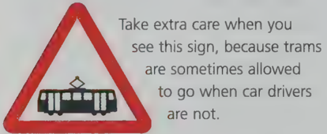

## Section 7 Other Types of Vehicle

We have already come across some of the other types of vehicle that share the road with you and your car including motorbikes and bicycles. The questions in this part of the Theory Test are mostly about long vehicles such as lorries. However, you also need to know what to do about

- buses
- caravans
- trams
- tractors and other farm vehicles
- special vehicles for disabled drivers (powered invalid carriages)
- slow vehicles such as road gritters
- motorway repair vehicles

Important points to remember about these types of vehicle

- Many of them can only move very slowly.
- They cannot easily stop or change direction.

The driver's field of vision may be restricted - this means that car drivers have to allow them The driver's field of vision may be restricted - this means that car drivers have to allow them plenty of room.

## Motorcycles

- Motorcycles are easily blown off course by strong winds. If you see a motorcyclist overtaking a high-sided vehicle such as a lorry, keep well back. The lorry may shield the motorcyclist from the wind as it is overtaking, but then a sudden gust could blow the motorcyclist off course.
- It can be hard to see a motorcyclist when you are waiting at a junction. Always look out for them.

## Other Types of Vehicle

- If you see a motorcyclist looking over their shoulder, it could mean that they will soon give a signal to turn right. This applies to cyclists too. Keep back to give them plenty of room.
- Motorcyclists and cyclists sometimes have to swerve to avoid hazards such as bumps in the road, patches of ice and drain covers. As before - give them plenty of room.

## Long vehicles

- Like cyclists, long vehicles coming up to roundabouts may stay in the left lane even if they intend to turn right. This is because they need lots of room to manoeuvre. Keep well back so they have room to turn.
- Take great care when overtaking long or high-sided vehicles. Before you pull out to overtake, make sure you have a clear view of the road ahead.
- A long vehicle that needs to turn left off a major road into a minor road may prepare to do so by moving out towards the centre of the road, or by moving across to the other side.

If you're following them

- Give way, and don't try to overtake - on the right or the left.
- You might need to slow down and stop while the driver of the long vehicle makes the turn.

## Buses and trams

- Always give way to buses when they signal to pull out.
- Always give way to trams as they cannot steer to avoid you.
- Don't try to overtake a tram.

Trams are quiet vehicles - you cannot rely on approaching engine noise to warn you that a tram is coming.

## Tractors and slow-moving vehicles Tractors

vehicles

- Always be patient if you are following a slow vehicle.

Drivers of slow vehicles will usually try to find a safe place to pull in to let the traffic go past In the meantime you should keep well back, so that you can see the road ahead. Allow a safe distance in case they slow down or stop.

Slow vehicles are not allowed on motorways because they cannot keep up with the fastmoving traffic. Vehicles not allowed on motorways include

- motorcycles under 50cc
- bicycles
- tractors and other farm vehicles
- powered invalid carriages

Now test yourself on the questions about Other Types of Vehicle

