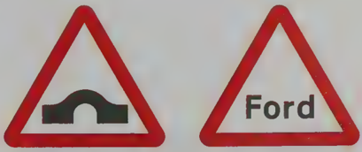
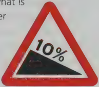

## Section 8 Vehicle Handling

The questions in this section test how much you know about controlling your vehicle on different road surfaces and in different weather.

Your control is affected by

- the road surface - is it rough or smooth? Are there any holes or bumps? Are there any 'traffic-calming measures', such as humps or chicanes?
- the weather conditions - you have to drive in different ways when there is fog, snow, ice or heavy rain.

Other questions in this section cover driving on country roads - on narrow and one-way roads, humpback bridges, steep hills, fords. Other questions need practical knowledge, for example, on engine braking, brake fade, and coasting your vehicle - use the Glossary.

This section also has some questions on overtaking and parking.

## Road surface

The condition of the road surface can affect the way your vehicle handles. Your vehicle handles better on a smooth surface than on a surface that is damaged, bumpy or full of holes. If you have to drive on an uneven surface, keep your speed down so that you have full control of your vehicle, even if your steering wheel is jolted.

Take care also where there are tramlines on the road. The layout of the road affects the way your vehicle handles.

)

You may have to adjust your driving for traffic calming measures, such as traffic humps (sometimes called 'sleeping policemen') and chicanes. These are double bends that have (sometimes called 'sleeping policemen') and chicanes. These are double bends that have been put into the road layout to slow the traffic down. The sign before the chicane tells you who has priority.

Traffic calming measures are often used in residential areas or near school entrances to make it safer for pedestrians.

## Weather conditions

Bad weather (adverse weather) such as heavy rain, ice or snow affects the way your vehicle handles. If you drive too fast in adverse weather, your tyres may lose their grip on the road when you try to brake. This means the car may skid or 'aquaplane'. Aquaplaning means sliding out of control on a wet surface.

## Driving in snow

In snow, the best advice is do not drive at all unless you really have to make a journey. If you have to drive in snowy conditions, leave extra time for your journey and keep to the main roads. You can fit snow chains to your tyres to increase their grip in deep snow.

## Driving in fog

In fog your field of vision can be down to a few metres. Your vehicle is fitted with fog lights to help you see and be seen in fog. But you must know how and when to use them. Look up the three rules about fog lights in The Highway Code. You'll see that the key points to remember are:

## Vehicle Handling

- Don't dazzle other road users with your fog lights.
- Switch them off as soon as you can see better (as soon as the fog starts to clear).

## Remember the two-second rule

You should double the two-second gap to four seconds when driving in rain, and increase the gap by as much as ten times when there is ice on the road.

\_ \_ \_

times when there is ice on the road. V \_ \_ \_ J

## Country driving

If you have had most of your driving lessons in a town, you need to know how to drive on narrow country roads. Some are only wide enough for one vehicle ('single-track'), and some are on very steep hills. enough for one vehicle ('sing

some are on very steep hills.

Your control of the gears, clutch and brakes will be important if you have to follow a tractor very slowly up a hill. On a steep downward slope you have to make sure your vehicle does not 'run away'.

On country roads you might find humpback bridges and fords. The signs below warn you of these hazards.

- Find out what you must do first after you have driven through a ford.

\

## Technical knowledge

We have already mentioned engine braking. Understanding how engine braking works is part of good vehicle handling.

Note: If you press the footbrake constantly on a long hill, you may get brake fade. If you're not sure, check what that means in the a long hill, you may get brake fade. If yo

not sure, check what that means in the Glossary at the back of this book.

Use the gears to control your vehicle on a downhill slope (or 'gradient'). If you put the vehicle in 'neutral', or drive with the clutch down (called coasting), your vehicle will increase speed beyond what is safe and will not be under proper control.

This sign warns you of a steep hill downwards.

- Coasting is wrong and dangerous - you should not be tempted to do it to save fuel.

Remember that if there is sudden heavy rain after a dry hot spell, the road surface can get very slippery.

Now test yourself on the questions about Vehicle Handling

