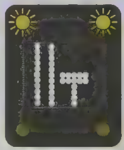
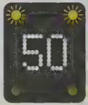
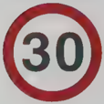
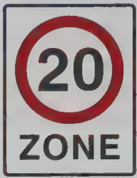
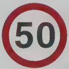
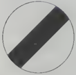

## Section 9 Motorway Rules

Learner drivers aren't allowed on motorways, so you can't get experience of what it's like to drive on them until you've passed your test. However, you do need to know all about MOTORWAY RULES before taking your Practical Test, and your Theory Test will most likely include a question about motorways.

As soon as you pass your driving test you will be legally allowed to drive on motorways. You need to know all the motorway rules in advance, so that you are confident and ready to cope with motorway driving when you pass your test.

There are some major roads and dual carriageways that learners can drive on which are very much like motorways. You may drive on some of these fast roads during your driving test, so that your examiner can see how well you cope with hazards at higher speeds.

When driving on these fast roads you will need some of the very same skills that you will need for motorway driving - for example, using lanes properly, knowing when it is safe to overtake, and controlling your vehicle at speed.

If you are learning to drive with a driving school, you will have the chance to book a motorway lesson with your instructor after you have passed your test. It makes sense to take up this offer before you drive on a motorway alone for the first time.

## Motorways and other roads

- On a motorway traffic is moving at high speed all the time.
- All lanes are in use.
- No stopping is allowed on a motorway traffic only slows or comes to a stop because of accidents or other types of hold-up.
- Some road users are not allowed on motorways. These include
- pedestrians, cyclists and learner drivers
- horses and other animals
- motorcycles under 50cc
- slow-moving vehicles, tractors and farm vehicles and invalid carriages
- You always enter and leave a motorway on the left, via a slip road.
- To the left of the inside lane (left-hand lane) on a motorway is the hard shoulder. You can only drive on this in an emergency.
- Special signs and signals are used on motorways. These include signs above the road on overhead gantries, signs on the central reservation, and amber and red flashing lights.

## Checks before your journey

Be extra careful about doing all your regular checks before you set out on a motorway journey. You cannot stop on the motorway to fix small problems, and no one wants to break down in the middle of fast traffic. Always check

- oil and coolant levels, screen wash container
- tyres and tyre pressures
- fuel gauge
- that all mirrors and windows are free of dirt and grease
- that the horn works

Many of these checks are legally necessary, as well as important for your safety.

## How to move on to the motorway How to mov

motorway

- Join the motorway by building up your speed on the slip road to match the speed of traffic in the left lane of the motorway.
- Use MSM (Mirrors - Signal - Manoeuvre) and move into the flow of traffic when it is safe to do so.

## Changing lanes and overtaking

Driving on a motorway needs all the skills you have learned about anticipation and forward planning.

## You should

- make good use of all mirrors, and check your blind spots
- signal to move out in plenty of time
- look out for hazards ahead in the lane you want to move to
- not go ahead if it will force another vehicle to brake or swerve
- keep a safe distance from the vehicle in front

## Take a break

When you drive on motorways you will sometimes see signs that say 'Tiredness can kill - take a break!' This is very good advice. Motorways are monotonous - boring to drive, with long stretches of road that look the same for miles. A major cause of accidents is drivers falling asleep at the wheel. Plan your journey so that you have time to get out, stretch your legs and have a drink or snack.

## The rules you need to know

- Keep to the left-hand lane unless you are overtaking and move back to the left lane as soon as it is safe to do so. Sometimes you need to stay in the centre lane for a time - for example, when a line of lorries is traveling up a hill in the left lane. Stay in the centre lane until you have passed the hazard, then signal left and return to the left lane.
- NEVER reverse park walk park walk drive in the wrong direction on the motorway.
- Don't exceed the speed limit. This is normally 70mph, but lower speed limits may be signed when the road is busy, or in bad weather.
- Keep to the correct separation distance (see Safety Margins).
- Don't overtake on the left. If traffic is moving slowly in all three lanes you may find that the lane on the left is moving faster than the one to its right for a short time. Or the left lane may be signed for traffic turning off at the next junction only. But these are exceptions to the rule.
- If luggage falls from your vehicle, do not get out to pick it up. Stop at the next emergency phone and tell the police. Posts on the edge of the motorway show the way to the nearest emergency phone. You should use these phones rather than your mobile phone, because the emergency phone connects directly to the police and tells them exactly where you are calling from on the motorway.
- Don't stop on the hard shoulder except in an emergency. The hard shoulder is an extremely dangerous place, as many as one in eight road deaths happen there.

## Traffic signs and road markings

## Light signals

In The Highway Code you'll find the light signals only seen on motorways. Signs abo In The Highway Code you'll find the light signals only seen on motorways. Signs above the roadway or on the central reservation are activated as needed to warn of accidents, lane

closures or weather conditions. Overhead gantries display arrows or red crosses showing which lanes are open or closed to traffic and which lanes to move to

when motorways merge or diverge. They may also show temporary speed limits.

## Direction signs

Direction signs on motorways are blue and those on other major roads are green - other direction signs are white with black print.

## Reflective studs

It's useful to know the colours of studs on a motorway; this can help in working out which part of the road you're on if it's dark or foggy. White studs mark lanes or the centre of part of the road you're on if it's dark or f

White studs mark lanes or the centre of the road and red studs mark the left edge of the carriageway.

Amber studs are used alongside the central reservation and green studs mark the entry

to a slip road.

Note: these markings are also found on some dual carriageways.

> **Using the hard shoulder**
>
> - Stop as far to the left as possible and, if you can, near an emergency phone.
> - Emergency phones are situated 1 mile apart and have blue and white marker posts every 100 metres. An arrow on the posts points the direction of the nearest phone.
> - If you are using a mobile phone you can identify your location from the number on the post.
> - Switch on your hazard warning lights.
> - Use the left-hand door to get out of the vehicle, and make sure your passengers do too.
> - Get everyone away from the road - if possible, behind the barrier or up the bank.
> - Leave animals in the vehicle unless they aren't safe there.
> - Phone the police with full details of where you are, then go back and wait in a safe place near your vehicle.

## Section 10

## Rules of the Road

'Rules of the Road' is a good way to describe what is in The Highway Code.

The questions that come under this heading in the Theory Test include several on road signs and road markings. There are many more road sign questions in the section on Road and Traffic Signs. Several of the topics listed in this section have already come up.

Other questions in this section cover

· speed limits · overtaking

· speed limits · overtaking

· parking

· lanes and roundabouts

· clearways

· box junctions

· crossroads

· pedestrian crossings

· towing caravans and trailers

## Speed limits

Driving too fast for the road, traffic or weather conditions causes accidents. Make

sure that you keep below the speed limit shown on the signs for the road that you are on.

30mph 50mph in a built-up on a long, area twisty country road or as low as 20mph in a residential area with speed humps or traffic calming measures

The national speed limit for cars on a dual carriageway is 70mph. This is also the maximum speed for motorway driving.

## National speed limit

When you leave a built-up area you will usually see this sign.

- This sign tells you that the national speed limit for this type of road applies here.
- The national speed limit for cars on a normal road (single carriageway outside a built-up area) is 60mph. So on this road you must drive below 60mph even if it is straight and empty.

Street lights usually mean that a 30mph limit applies, unless there are signs showing other limits.

## The right speed for the conditions

If it is raining or there is snow and ice on the road or if you are driving in a high wind you will have to drive more slowly than the maximum speed limit. This will keep you and other road users safe.

- Remember - you have to double the time you allow for stopping and braking in wet weather. Allow even more time in snow and ice.
- You need to be extra careful when driving in fog.

## The right speed for your vehicle

Some other vehicles have lower speed limits than cars. You can find out more about speed limits from the table in The Highway Code.

## Parking rules

There are some general rules about parking that all drivers should know.

- Whenever you can, you should use offstreet car parks, or parking bays. These are marked out with white lines on the road.
- Never park where your vehicle could be a danger to other road users.

Look for special signs that tell you that you cannot park there at certain times of the day or that only certain people may park in that place. Examples include signs showing bus lanes, cycle lanes, residents' parking zones and roads edged with red or yellow lines. lanes, cycle lanes, residents' parking zones and roads edged with red or yellow lines.

Orange or blue badges are given to people with disabilities. Do not park in a space reserved for a disabled driver, even if that is the only place left to park. A disabled driver

may need to park there. You will break the law if you park in that space.

## Parking at night

- If you park at night on a road that has a speed limit higher than 30mph, you must switch on your parking lights. You must switch on your parking lights even if you have parked in a lay-by on this type of road.
- When parking at night, always park facing in the same direction as the traffic flow.
- If your vehicle has a trailer, you must switch on parking lights, even if the road has a 30mph speed limit.

## Where not to park

You are not permitted to park

- on the pavement
- at a bus stop
- in front of someone's drive
- opposite a traffic island
- near a school entrance
- on a pedestrian crossing (or inside the zigzag lines either side of it)
- near a junction
- on a clearway
- on a motorway

Now test yourself on the questions about Rules of the Road

## Road and Traffic Signs

