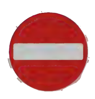
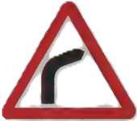
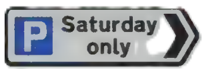
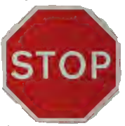

## Section 1 1 Road and Traffic Signs

When you look up the chapter on ROAD AND TRAFFIC SIGNS in the Theory Test questions you will see that it takes up a lot of pages. This is because most of the questions have a picture of a road sign or marking. You will also see that a lot of questions ask 'What does this sign mean?'

But however differently the questions are worded, it all comes down to how well you know The Highway Code. You can try to learn as much of The Highway Code as possible, but there are other ways you can get to know the road signs.

As you walk or drive around, look at the road signs you see in the street, and the different markings painted on the road surface.

## On foot

Look at the signs and signals that all road users must obey, whether they are in a car or walking. For example, when you use a pedestrian crossing, check what kind of crossing it is (such as a pelican, toucan or zebra crossing).

## Check whether you know the following Check whet

following

- What are the rules for pedestrians and drivers coming up to the crossing?
- What kinds of crossings are controlled by traffic lights?
- What is different about a zebra crossing?

## Road and Traffic Signs

During your driving lessons
If you are having a driving lesson look well ahead so that you see all the signs that tell you what to do next. Obey them in good time.
During your test

When you take your test the examiner will tell you when to move off, when to make a turn and when to carry out one of the set manoeuvres. The examiner will expect you to watch out for lane markings on the road, and signs giving directions, and to decide how to react to these yourself.

## Signs

If you see several signs all on the same post, it can be confusing. The general rule is to start at the top and read down the post. The sign at the top tells you about the first hazard you have to look out for.
If you are a passenger in a car on a motorway, look at the motorway signs, because you need to know them, even though you can’t drive on a motorway yet yourself.
Check that you can answer the following:

- What colour are the signs at the side of the motorway?
- What do the light signals above the road tell you?
- What signs tell you that you are coming to an exit?

## Shapes of Signs

Road and traffic signs come in three main shapes. Get to know them. You must learn what the signs mean.

#### Circles
Signs in circles tell you to do (blue) or not do (red) something – they give orders.
Example:

#### Triangles

Signs in triangles tell you of a hazard ahead – they give warnings.
Example:

#### Rectangles

Signs in rectangles tell you about where you are or where you are going – they give information.
Example:

#### Octagon

There is only one sign which is octagonal – that is, it has eight sides. This is the sign for STOP. The eight-sided shape makes the sign stand out.
Example:

