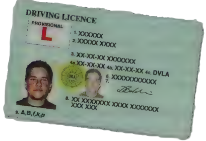

## Section 12 Documents

This is quite a short section in the Theory Test questions. It is also different from the other sections, because it does not deal with either your driving skills or knowledge of The Highway Code.

It covers all the paperwork and the laws that you need to know about when you start learning to drive.

In this section there are questions about

- driving licences
- insurance
- MOT certificate
- Vehicle Excise Duty (tax disc)
- Vehicle Registration Document (log book)

This section also covers who can supervise a learner driverand changes you must tell the licensing authority about

## Driving licence

If you are learning to drive, you need a provisional licence.

- You must have a valid licence to drive legally.
- All licences now have two parts - a photo card and a paper document.
- Your signature appears on both parts of the licence.
- Take good care of your provisional licence. If you lose it by mistake, you can get another one but you will have to pay a fee, and wait for the new licence to come.
- When you pass your test you can apply for a full licence.

## Insurance

You must have a valid insurance certificate that covers you at least for third party liability. If you are learning with a driving school, you are covered by their insurance while you are in the driving school car. When you are in your own or anybody else's car, you must have insurance. Third party insurance cover usually comes as 'Third Party, Fire and Theft'. It is a basic insurance policy that will pay for repairs to another person's car and allows you to claim on the other driver's insurance if you are in an accident that was not your fault. If you have comprehensive insurance, the policy will pay for repairs to your vehicle even when the accident was your fault.

## MOT certificate

Cars and motorcycles must have their first MOT test three years after they are new and first registered. After that, they must have an MOT test every year.

## The MOT test checks that your vehicle

- is roadworthy - that is, all the parts work properly and the vehicle is safe to drive
- keeps to the legal limits for exhaust emissions - that is, the level of poisons in the gas that comes from the exhaust

If your vehicle is more than three years old you must not drive it without a valid MOT certificate - unless you are on your way to get an MOT and you have booked it in advance.

## Vehicle Excise Duty (tax disc)

Your vehicle must have an up-to-date tax disc on the windscreen. The disc shows that you have paid Vehicle Excise Duty up to the date on the disc (you can pay for 6 or 1 2 months at a time). If you don't renew your tax disc within a month of the old one expiring you will be automatically fined. If you are not going to renew your tax disc (if you don't use your vehicle or keep it on a public road) you must inform the DVLA by completing a Statutory Off Road Vehicle Notification (SORN).

Vehicle Excise Duty is the tax that the government charges you to drive your vehicle on the roads. It is also sometimes called road tax. When you get your tax disc, you must show proof that your vehicle is insured, and that it has a valid MOT if required.

## Vehicle Registration Document/Certificate Vehicle Registration Document/Certificate

The Vehicle Registration Document/Certificate has all the important details about you and your vehicle, such as the make and model of the vehicle. It also has your name and address as the registered keeper of the vehicle. It is a record of the vehicle's history and is sometimes called 'the log book'.

## DVLA

The Driver and Vehicle Licensing Agency is known as the DVLA. You must tell the DVLA if you are going to keep your car off road and are not renewing your tax disc, when you buy or sell a car and if you change your name or your address.

This is because your details go on to the Vehicle Registration Document/Certificate and you are legally responsible for the vehicle (car tax, parking fines, etc) until you have notified the DVLA that it is off road or you have sold it.

## Supervising a learner driver

As a learner driver you cannot drive on your own. If you are not with your driving instructor, you must be supervised by a person who is at least 21 years old, has a full licence for the kind of car you drive and has had that licence for at least three years. Note that if a person has a licence to drive an automatic car only, they cannot supervise a learner in a manual car.

Now test yourself on the questions about Documents on the questions about Documents

