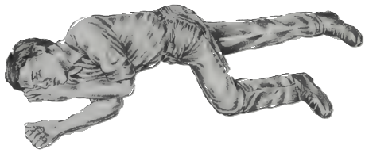

## Section 13 Accidents

The questions in this section are about helping anyone who is hurt in a road accident. Some people think they might do more harm than good if they try to help. But if you have a basic knowledge of first aid you won't panic and if you are first on the scene at an accident, you could even save a life. Look up Accidents and First Aid in The Highway Code.

The Theory Test questions in this section cover

- what to do when warning lights come on in your vehicle
- what to do if you break down
- safety equipment to carry with you
- when to use hazard warning lights
- what to do - and what not to do - at the scene of an accident
- what to do in tunnels

## Basic first aid

What to do at an accident scene

- Check that you are not putting yourself in danger before you go to help somebody else. You may need to warn other drivers of the accident.
- Check all vehicle engines are switched off.
- Make sure no one is smoking.
- Move people who are not injured to a safe place. If the accident has happened on a motorway, if possible get uninjured people away from the hard shoulder, behind the barrier or on to the bank.
- Call the emergency services. You will need to tell them exactly where you are, and how many vehicles are involved in the accident. On motorways, use the emergency phone which connects directly to the police and tells them exactly where you are.
- Do not move injured people - unless there is a risk of fire or of an explosion.
- Give essential first aid to injured people (see below).
- Stay there until the emergency services arrive.

## The ABC of first aid

This tells you what three things to check for when you go to help an injured person

- A is for Airway
- B is for Breathing
- C is for Circulation

Airway

If an injured person is breathing, but unconscious, if possible place them in the recovery position. If they are not breathing, first make sure there is nothing in their mouth that might be blocking the airway.

## Breathing

If you have checked the airway and they are still not breathing, then give first aid as follows

- lift their chin
- carefully tilt their head back to open their airway carefully tilt
- pinch their nose and blow into their mouth until their chest rises
Repeat this every 4 seconds until the person can breathe alone, or until help arrives

## Accidents

• pinch their nose and blow into their  mouth until  their  chest  risesRepeat  this every 4  seconds  until  the  person can  breathe alone,  or  until help  arrives

### Circulation

'Circulation' here means 'bleeding'. If a person is bleeding, press firmly on the wound for up to 10 minutes, until the bleeding slows or stops. You can raise an injured arm or leg to reduce the bleeding - as long as the limb is not broken. If you carry a first aid kit use a sterile dressing over the wound.

### Other ways to help

• Do speak in a calm way to the injured person. • Do try to keep them warm and as comfortable as possible.
• Do not give them anything to drink.
• Do not give them a cigarette.
• Don't let injured people wander into the road.

### The AA's advice on safety if you break down

#### If you are on a non-motorway road

- Try to get your vehicle off the main road. At least, get it right to the side of the road or on to the verge.
- If the vehicle is in a place where it might be hit by another vehicle, get any passengers out and to a safer place.
- Switch on the hazard warning lights to warn other drivers.
- If you have a red warning triangle, place it at least 45 metres behind your car to warn other traffic (but don't use it on a motorway).
- If you are a member of a motoring organisation such as the AA, call them and tell them where you are and what has happened. Wait with your vehicle until the patrol arrives.

#### If you are on a motorway

- If possible, leave the motorway at the next exit. If you can't get that far, drive on to the hard shoulder. Stop far over to the left, and switch on your hazard warning lights.
- Get everyone out of the vehicle, using the nearside doors (but leave pets in the vehicle). Get them to sit on the bank, well away from the traffic.
- Use the nearest orange emergency phone to call the emergency services and tell them where you are and what has happened (for your safety, face the oncoming traffic while you are on the phone).
- Go back to your vehicle and wait on the bank near by until help arrives.
- Do not cross the motorway on foot or try to do repairs yourself - even changing a wheel. This is too dangerous on a motorway.

### DID YOU KNOW?

Before driving into a tunnel you should tune into a local radio station and listen to the traffic reports in case there are any accidents or problems in the tunnel.
